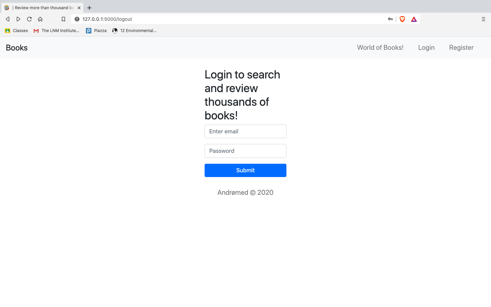

# [Review Someone's World](https://priyanshbordia.github.io/Book-Review-Website/) !

#### You can find the app @ [Heroku](http://book-review--website.herokuapp.com)

> You can find walk through at [YouTube](https://www.youtube.com/watch?v=E8LRK0CXwdk )

It's a simple book review website using python's web framework `Flask` and styles using `HTML`, `CSS`,`SASS`.

To run this app locally, follow these instructions:
```
git clone https://github.com/PriyanshBordia/Books-Reviews-Website.git
cd Books-Review-Website
pip install -r requirements.txt
bash run_local.sh
```
## Here are some screenshots that show functionality of my app:

#### Registration Page:


#### Login Page:


### Search:


### Search Results:


### Book:


### Book Reviewed

